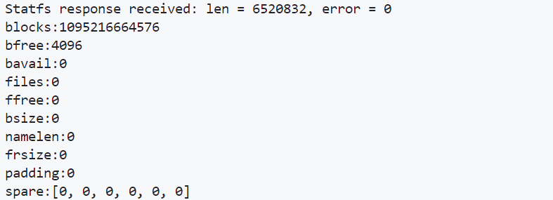

# Implement of  Virtio-FS for Asterinas

## 设备配置空间

在我们实现的 Virtio 文件系统（virtio-fs）中，设备配置空间的设计严格遵循了 Virtio 规范，以确保与设备进行高效且兼容的通信。以下是设备配置空间的关键设计元素和实现细节。

#### 1. 设备配置结构

我们定义的 `VirtioFilesystemConfig` 结构体与 Virtio 白皮书中描述的设备配置布局一致，包含了以下字段：

- **`tag`**：一个长度为 36 字节的 UTF-8 编码字符串，用于标识文件系统的名称。如果字符串长度不足 36 字节，则会用 NUL 字节进行填充。如果编码后的字节正好填满整个字段，则该字段不以 NUL 字符结尾。
- **`num_request_queues`**：一个 32 位无符号整数，表示设备暴露的请求队列数。设备可以暴露多个 virtqueue 来提高并行处理能力，从而提升性能。
- **`notify_buf_size`**：一个 32 位无符号整数，指定通知队列中每个缓冲区的最小字节数。此字段仅在启用了 `VIRTIO_FS_F_NOTIFICATION` 特性时才有效，用于处理设备发送的 FUSE 通知消息。

#### 2. 特性标志

为了支持设备的不同功能，我们设计了 `FilesystemFeatures` 位标志结构，定义了设备的可用特性。在当前实现中，支持的特性为 `VIRTIO_FS_F_NOTIFICATION`，表示设备能够发送 FUSE 通知。该特性在设备配置中设置通知缓冲区大小时至关重要。

```rust
bitflags::bitflags! {
    pub struct FilesystemFeatures: u64 {
        const VIRTIO_FS_F_NOTIFICATION = 1 << 0;
    }
}
```

#### 3. 设备配置管理

`ConfigManager` 负责管理与 Virtio 设备配置空间的交互。通过此模块，驱动程序能够安全且高效地读取设备配置，确保所有字段的值被正确填充：

- **`new_manager`**：该方法用于初始化一个新的 `ConfigManager` 实例，负责管理设备配置内存的访问。通过 `SafePtr` 提供对配置区域的安全指针。
- **`read_config`**：该方法从设备内存中读取配置数据，包括 `tag`、`num_request_queues` 和 `notify_buf_size` 字段，确保所有配置项的正确读取和验证。

```rust
impl ConfigManager<VirtioFilesystemConfig> {
    pub(super) fn read_config(&self) -> VirtioFilesystemConfig {
        let mut fs_config = VirtioFilesystemConfig::new_uninit();

        // 读取 tag 字段
        for i in 0..fs_config.tag.len() {
            fs_config.tag[i] = self
                .read_once::<u8>(offset_of!(VirtioFilesystemConfig, tag) + i)
                .unwrap();
        }

        fs_config.num_request_queues = self
            .read_once::<u32>(offset_of!(VirtioFilesystemConfig, num_request_queues))
            .unwrap();

        fs_config.notify_buf_size = self
            .read_once::<u32>(offset_of!(VirtioFilesystemConfig, notify_buf_size))
            .unwrap();

        fs_config
    }
}
```

初始化后打印出的设备配置信息如下：


#### 4. 关键设计考虑

- **驱动程序合规性**：根据 Virtio 规范，驱动程序不得直接修改设备配置字段。驱动程序只能读取设备配置中的各个字段以获取设备的状态。
- **队列并行性**：设备配置中的 `num_request_queues` 字段允许驱动程序使用多个请求队列来提高性能。多个队列的使用并不会改变请求的顺序，目的是实现更高效的并行处理。
- **通知缓冲区**：如果设备启用了 `VIRTIO_FS_F_NOTIFICATION` 特性，`notify_buf_size` 字段将指定每个通知缓冲区的最小大小，这对于正确处理 FUSE 通知至关重要。

## 设备初始化

设备初始化是确保 Virtio 文件系统（virtio-fs）正常工作的关键过程。在我们的实现中，设备初始化遵循了 Virtio 规范和 FUSE 协议，确保设备在与主机交互前被正确配置。以下是设备初始化过程的详细说明。

#### 1. Virtqueue 初始化

驱动程序首先通过探测设备的 virtqueue 来进行初始化。这些 virtqueue 提供了通信的基本通道，用于处理不同类型的请求。根据设备的配置，我们创建并初始化多个 virtqueue，包括：

- **高优先级队列**：用于处理需要立即响应的请求。
- **通知队列**：如果启用了 `VIRTIO_FS_F_NOTIFICATION` 特性，则用于接收 FUSE 通知消息。
- **请求队列**：根据 `num_request_queues` 字段的值，动态分配多个请求队列，以提升系统的并发处理能力。

#### 2. 缓冲区分配

在初始化过程中，我们为每个队列分配了相应的缓冲区：

- **请求缓冲区**：这些缓冲区用于存储请求及其响应。它们通过 DMA 操作与设备内存进行数据交换。
- **通知缓冲区**：用于存储和传输 FUSE 通知消息。
- **高优先级缓冲区**：用于处理高优先级请求。

#### 3. 特性协商

设备初始化过程的第一步是协商设备特性。通过检查 `FilesystemFeatures` 位标志，我们确保只启用设备和驱动程序都支持的功能。在我们的实现中，当前支持的特性为 `VIRTIO_FS_F_NOTIFICATION`，允许设备发送 FUSE 通知。

```rust
pub(crate) fn negotiate_features(features: u64) -> u64 {
    let device_features = FilesystemFeatures::from_bits_truncate(features);
    let supported_features = FilesystemFeatures::supported_features();
    let filesystem_features = device_features & supported_features;
    debug!("features negotiated: {:?}", filesystem_features);
    filesystem_features.bits()
}
```

#### 4. FUSE 会话初始化

FUSE 会话的初始化是通过发送 `FUSE_INIT` 请求来完成的。请求由以下部分组成：

- **FuseInHeader**：包含请求的元数据。
- **FuseInitIn**：FUSE 特定的初始化数据，包括内核版本和支持的特性标志。

请求通过一个请求 virtqueue 发送到设备，并通过 DMA 机制与设备内存交换数据。初始化请求完成后，设备与驱动程序之间的 FUSE 会话即告成立。

#### 5. 中断和异步处理

初始化过程中，我们还设置了中断处理程序，用于在收到请求或通知时进行后续处理。当设备完成某个请求或发送通知时，相应的处理程序会被触发，从而实现异步的数据处理。

```rust
fn handle_recv_irq(&self) {
    let mut request_queue = self.request_queues[0].disable_irq().lock();
    let Ok((_, len)) = request_queue.pop_used() else {
        return;
    };
    self.request_buffers[0].sync(0..len as usize).unwrap();

    let mut reader = self.request_buffers[0].reader().unwrap();
    let headerin = reader.read_val::<FuseInHeader>().unwrap();
    let datain = reader.read_val::<FuseInitIn>().unwrap();
    let headerout = reader.read_val::<FuseOutHeader>().unwrap();

    match FuseOpcode::try_from(headerin.opcode).unwrap() {
        FuseOpcode::FuseInit => {
            let dataout = reader.read_val::<FuseInitOut>().unwrap();
            early_print!("Received Init Msg\n");
            early_print!("major:{:?}\n", dataout.major);
            early_print!("minor:{:?}\n", dataout.minor);
            early_print!("flags:{:?}\n", dataout.flags);
        }
        _ => {}
    }
}
```

#### 6. 关键设计考虑

- **异步处理与高效通信**：通过设置多个请求队列和通知队列，驱动程序可以并行处理多个请求，并能够及时响应来自设备的通知。
- **DMA 缓冲区同步**：在发送请求之前，所有缓冲区都会与设备内存进行同步，以确保数据传输的正确性和一致性。
- **FUSE 协议遵循**：在整个初始化过程中，我们严格遵循 FUSE 协议，确保驱动程序与设备之间的交互符合协议要求。

## 设备操作

### 设备操作

在操作设备时，设备配置空间中的每个字段都可以由驱动程序或设备更改。

每当设备触发这样的配置更改时，驱动程序会收到通知。这使得驱动程序可以缓存设备配置，避免昂贵的配置读取，除非收到通知。

#### 设备配置更改通知

对于设备特定的配置信息可以更改的设备，当发生设备特定的配置更改时，会发送配置更改通知。

此外，当设备设置 `DEVICE_NEEDS_RESET` 时（见 2.1.2），也会触发此通知。

```rust
impl FilesystemDevice {
    fn handle_device_config_change(&self) {
        // 读取设备配置
        let config = self.config_manager.read_config();
        
        // 处理配置更改逻辑
        debug!("Device configuration changed: {:?}", config);
        
        // 如果需要重置设备
        if config.device_needs_reset() {
            self.reset_device();
        }
    }

    fn reset_device(&self) {
        // 执行设备重置逻辑
        debug!("Resetting device...");
        // 具体的重置操作
    }
}
```

在`test_device`函数中，我们可以模拟设备配置更改通知的处理：
```rust
// filepath: /home/robin/asterinas_virtofs/kernel/comps/virtio/src/device/filesystem/device.rs
pub fn test_device(device: &FilesystemDevice) {
    let mut test_counter = TEST_COUNTER.write();
    *test_counter += 1;
    drop(test_counter);
    let test_counter = TEST_COUNTER.read();
    match *test_counter {
        1 => {
            // 模拟设备配置更改通知
            device.handle_device_config_change();
        }
        _ => {}
    };
}
```
通过上述实现，我们确保了在设备配置更改时，驱动程序能够正确处理通知，并根据需要执行相应的操作。

## 设备基础功能实现

### 设备基础功能

我们的 Virtio 文件系统（virtio-fs）实现了一组基本的设备操作，包括设备初始化、文件系统挂载、文件查找、文件读取、文件写入、文件/文件夹打开、文件/文件夹[关闭等。这些操作遵循 Virtio 规范和 FUSE 协议，确保设备与主机之间的通信和数据交换正确无误。


以下是部分设备基础功能的测试结果, 基础功能外的更多功能测试不在报告中给出, 详细测试请查看代码device.rs文件中的测试代码。

### lookup

lookup的测试代码如下：
```rust
test lookup

1 => device.lookup(1, Vec::from("testf01"))
```
lookup的测试结果如下：


###  opendir and readdir

opendir and readdir的测试代码如下：
```rust
test opendir and readdir
1 => device.lookup(1, Vec::from("testdir")),
2 => device.opendir(2, 0),
3 => device.readdir(2, 0, 0, 256),
```
opendir and readdir的测试结果如下：


### open

open的测试代码如下：
```rust
 test open:

1 => device.lookup(1, Vec::from("testf01")),
2 => device.open(2, 0),
```
open的测试结果如下：


### read

read的测试代码如下：
```rust
 test read:

1=> device.lookup(1, Vec::from("testf02")),
2 => device.open(3, 0),
3 => device.read(3, 1, 0, 128),
```
read的测试结果如下：


### write

write的测试代码如下：
```rust
test write:

1 => device.lookup(1, Vec::from("testf_write")),
2 => device.open(2, 2),
3 => device.write(2, 0, 0, "Test write file".as_bytes()),
```
write的测试结果如下：


### flush

flush的测试代码如下：
```rust
test flush:

1 => device.lookup(1, "testf01".as_bytes().to_vec()),
2 => device.open(2, 0),
3 => device.flush(2, 0, 0),
```
flush的测试结果如下：


### releasedir

releasedir的测试代码如下：
```rust
test releasedir:

1 => device.lookup(1, "testdir".as_bytes().to_vec()),
2 => device.opendir(2, 0),
3 => device.readdir(2, 0, 0, 256),
4 => device.releasedir(2, 0, 0),
5 => device.readdir(2, 0, 0, 256),
```
releasedir的测试结果如下：


### getattr

getattr的测试代码如下：
```rust
test getattr
1 => device.lookup(1, "testdir".as_bytes().to_vec()),
2 => device.getattr(2, 0, 0, 0),
```
getattr的测试结果如下：


### release

release的测试代码如下：
```rust
test release
1 => device.lookup(1, "testf01".as_bytes().to_vec()),
2 => device.open(2, 0),
3 => device.read(2, 0, 0, 128),
4 => device.release(2, 0, 0, 0, true),
5 => device.read(2, 0, 0, 128),
```
release的测试结果如下：


### statfs

statfs的测试代码如下：
```rust
test statfs
1 => device.statfs(1),
```
statfs的测试结果如下：


### mkdir

mkdir的测试代码如下：
```rust
test mkdir
1 => device.mkdir(1, 0o755, 0o777, "test_mkdir".as_bytes().to_vec()),

```
mkdir的测试结果如下：


### destroy

destroy的测试代码如下：
```rust
test destroy:
1 => device.destroy(),
```
destroy的测试结果如下：


## FUSE接口实现

### Introduction

基于[root/include/uapi/linux/fuse.h](https://git.kernel.org/pub/scm/linux/kernel/git/torvalds/linux.git/tree/include/uapi/linux/fuse.h)中提供的fuse协议，我们实现了以下FUSE接口：


```rust
pub trait AnyFuseDevice {
   fn init(&self);
   fn readdir(&self, nodeid: u64, fh: u64, offset: u64, size: u32);
   fn opendir(&self, nodeid: u64, flags: u32);
   fn open(&self, nodeid: u64, flags: u32);
   fn read(&self, nodeid: u64, fh: u64, offset: u64, size: u32);
   fn flush(&self, nodeid: u64, fh: u64, lock_owner: u64);
   fn releasedir(&self, nodeid: u64, fh: u64, flags: u32);
   fn getattr(&self, nodeid: u64, fh: u64, flags: u32, dummy: u32);
   fn setattr( &self, nodeid: u64, valid: u32, fh: u64, size: u64, lock_owner: u64, atime: u64, mtime: u64, ctime: u64, atimensec: u32, mtimensec: u32, ctimensec: u32, mode: u32, uid: u32, gid: u32);
   fn lookup(&self, nodeid: u64, name: Vec<u8>);
   fn release(&self, nodeid: u64, fh: u64, flags: u32, lock_owner: u64, flush: bool);
   fn access(&self, nodeid: u64, mask: u32);
   fn statfs(&self, nodeid: u64);
   fn interrupt(&self, unique: u64);
   fn write(&self, nodeid: u64, fh: u64, offset: u64, data: &[u8]);
   fn mkdir(&self, nodeid: u64, mode: u32, umask: u32, name: Vec<u8>);
   fn create(&self, nodeid: u64, name: Vec<u8>, mode: u32, umask: u32, flags: u32);
   fn destroy(&self);
   fn rename(&self, nodeid: u64, name: Vec<u8>, newdir: u64, newname: Vec<u8>);
   fn rename2(&self, nodeid: u64, name: Vec<u8>, newdir: u64, newname: Vec<u8>, flags: u32);
   fn forget(&self, nodeid: u64, nlookup: u64);
   fn batch_forget(&self, forget_list: &[(u64, u64)]);
   fn link(&self, nodeid: u64, oldnodeid: u64, name: Vec<u8>);
   fn unlink(&self, nodeid: u64, name: Vec<u8>);
   /// 以上接口均进行测试，并后附测试过程及结果

   /// 以下接口未进行实际测试，仅实现
   fn bmap(&self, nodeid: u64, blocksize: u32, index: u64);
   fn fallocate(&self, nodeid: u64, fh: u64, offset: u64, length: u64, mode: u32);
   fn fsync(&self, nodeid: u64, fh: u64, datasync: u32);
   fn fsyncdir(&self, nodeid: u64, fh: u64, datasync: u32);
   fn getlk( &self, nodeid: u64, fh: u64, lock_owner: u64, start: u64, end: u64, typ: u32, pid: u32);
   fn getxattr(&self, nodeid: u64, name: Vec<u8>, size: u32);
   fn ioctl(&self, nodeid: u64, fh: u64, flags: u32, cmd: u32, in_data: &[u8]);
   fn listxattr(&self, nodeid: u64, size: u32);
   fn lseek(&self, nodeid: u64, fh: u64, offset: u64, whence: u32);
   fn mknod(&self, nodeid: u64, name: Vec<u8>, mode: u32, rdev: u32);
   fn poll(&self, nodeid: u64, fh: u64, events: u32);
   fn readlink(&self, nodeid: u64);
   fn removexattr(&self, nodeid: u64, name: Vec<u8>);
   fn rmdir(&self, nodeid: u64, name: Vec<u8>);
   fn setlk(&self,nodeid: u64,fh: u64,lock_owner: u64,start: u64,end: u64,typ: u32,pid: u32,sleep: u32);
   fn setlkw(&self,nodeid: u64,fh: u64,lock_owner: u64,start: u64,end: u64,typ: u32,pid: u32,sleep: u32);
   fn symlink(&self, nodeid: u64, name: Vec<u8>, link: Vec<u8>);
}
```

### FUSE_INIT

`FUSE_INIT` 接口用于初始化文件系统实例。以下是该接口的实现步骤：

1. **输入**：
   - `FuseInHeader`：包含请求的元数据，包括请求长度、操作码、唯一标识符、节点 ID、用户 ID、组 ID、进程 ID 等。
   - `FuseInitIn`：包含初始化的参数，包括 FUSE 协议的主版本号、次版本号、最大读取块大小等。

2. **输出**：
   - `FuseOutHeader`：包含响应的元数据，包括响应长度、错误码、唯一标识符等。
   - `FuseInitOut`：包含初始化的响应数据，包括 FUSE 协议的主版本号、次版本号、支持的特性标志等。

```rust
#[repr(C)]
#[derive(Default, Debug, Clone, Copy, Pod)]
pub struct FuseInitIn {
    pub major: u32,
    pub minor: u32,
    pub max_readahead: u32,
    pub flags: u32,
    pub flags2: u32,
    pub unused: [u32; 11],
}

#[repr(C)]
#[derive(Default, Debug, Clone, Copy, Pod)]
pub struct FuseInitOut {
    pub major: u32,
    pub minor: u32,
    pub max_readahead: u32,
    pub flags: u32,
    pub max_background: u16,
    pub congestion_threshold: u16,
    pub max_write: u32,
    pub time_gran: u32,
    pub max_pages: u16,
    pub map_alignment: u16,
    pub flags2: u32,
    pub max_stack_depth: u32,
    pub unused: [u32; 6],
}
```

### FUSE_OPENDIR

`FUSE_OPENDIR` 接口用于打开一个目录。以下是该接口的实现步骤：

1. **输入**：
   - `FuseInHeader`：包含请求的元数据，包括请求长度、操作码、唯一标识符、节点 ID、用户 ID、组 ID、进程 ID 等。
   - `FuseOpenIn`：包含打开目录的参数，包括标志位和打开标志。

2. **输出**：
   - `FuseOutHeader`：包含响应的元数据，包括响应长度、错误码、唯一标识符等。
   - `FuseOpenOut`：包含打开目录的响应数据，包括文件句柄、打开标志和后备 ID。

```rust
#[repr(C)]
#[derive(Default, Debug, Clone, Copy, Pod)]
pub struct FuseOpenIn {
    pub flags: u32,
    pub open_flags: u32, /* FUSE_OPEN_... */
}

#[repr(C)]
#[derive(Default, Debug, Clone, Copy, Pod)]
pub struct FuseOpenOut {
    pub fh: u64,
    pub open_flags: u32,
    pub backing_id: i32,
}
```

### FUSE_READDIR

`FUSE_READDIR` 接口用于读取目录内容。以下是该接口的实现步骤：

1. **输入**：
   - `FuseInHeader`：包含请求的元数据，包括请求长度、操作码、唯一标识符、节点 ID、用户 ID、组 ID、进程 ID 等。
   - `FuseReadIn`：包含读取目录的参数，包括文件句柄、偏移量、读取大小、读取标志、锁所有者和标志。

2. **输出**：
   - `FuseOutHeader`：包含响应的元数据，包括响应长度、错误码、唯一标识符等。
   - `FuseDirent` 和 `FuseDirentWithName`：包含目录项的元数据和名称。

```rust
#[repr(C)]
#[derive(Default, Debug, Clone, Copy, Pod)]
pub struct FuseReadIn {
    pub fh: u64,
    pub offset: u64,
    pub size: u32,
    pub read_flags: u32,
    pub lock_owner: u64,
    pub flags: u32,
    pub padding: u32,
}

#[repr(C)]
#[derive(Default, Debug, Clone, Copy, Pod)]
pub struct FuseDirent {
    pub ino: u64,
    pub off: u64,
    pub namelen: u32,
    pub type_: u32,
    pub name: [u8; 0],
}
```

### FUSE_OPEN

`FUSE_OPEN` 接口用于打开一个文件。以下是该接口的实现步骤：

1. **输入**：
   - `FuseInHeader`：包含请求的元数据，包括请求长度、操作码、唯一标识符、节点 ID、用户 ID、组 ID、进程 ID 等。
   - `FuseOpenIn`：包含打开文件的参数，包括标志位和打开标志。

2. **输出**：
   - `FuseOutHeader`：包含响应的元数据，包括响应长度、错误码、唯一标识符等。
   - `FuseOpenOut`：包含打开文件的响应数据，包括文件句柄、打开标志和后备 ID。

```rust
#[repr(C)]
#[derive(Default, Debug, Clone, Copy, Pod)]
pub struct FuseOpenIn {
    pub flags: u32,
    pub open_flags: u32, /* FUSE_OPEN_... */
}

#[repr(C)]
#[derive(Default, Debug, Clone, Copy, Pod)]
pub struct FuseOpenOut {
    pub fh: u64,
    pub open_flags: u32,
    pub backing_id: i32,
}
```

### FUSE_READ

`FUSE_READ` 接口用于读取文件内容。以下是该接口的实现步骤：

1. **输入**：
   - `FuseInHeader`：包含请求的元数据，包括请求长度、操作码、唯一标识符、节点 ID、用户 ID、组 ID、进程 ID 等。
   - `FuseReadIn`：包含读取文件的参数，包括文件句柄、偏移量、读取大小、读取标志、锁所有者和标志。

2. **输出**：
   - `FuseOutHeader`：包含响应的元数据，包括响应长度、错误码、唯一标识符等。
   - 文件内容：包含读取的文件数据。

```rust
#[repr(C)]
#[derive(Default, Debug, Clone, Copy, Pod)]
pub struct FuseReadIn {
    pub fh: u64,
    pub offset: u64,
    pub size: u32,
    pub read_flags: u32,
    pub lock_owner: u64,
    pub flags: u32,
    pub padding: u32,
}
```

### FUSE_FLUSH

`FUSE_FLUSH` 接口用于刷新文件的缓冲区。以下是该接口的实现步骤：

1. **输入**：
   - `FuseInHeader`：包含请求的元数据，包括请求长度、操作码、唯一标识符、节点 ID、用户 ID、组 ID、进程 ID 等。
   - `FuseFlushIn`：包含刷新文件的参数，包括文件句柄和锁所有者。

2. **输出**：
   - `FuseOutHeader`：包含响应的元数据，包括响应长度、错误码、唯一标识符等。

```rust
#[repr(C)]
#[derive(Default, Debug, Clone, Copy, Pod)]
pub struct FuseFlushIn {
    pub fh: u64,
    pub unused: u32,
    pub padding: u32,
    pub lock_owner: u64,
}
```

### FUSE_RELEASEDIR

`FUSE_RELEASEDIR` 接口用于关闭一个打开的目录。以下是该接口的实现步骤：

1. **输入**：
   - `FuseInHeader`：包含请求的元数据，包括请求长度、操作码、唯一标识符、节点 ID、用户 ID、组 ID、进程 ID 等。
   - `FuseReleaseIn`：包含关闭目录的参数，包括文件句柄和标志位。

2. **输出**：
   - `FuseOutHeader`：包含响应的元数据，包括响应长度、错误码、唯一标识符等。

```rust
#[repr(C)]
#[derive(Default, Debug, Clone, Copy, Pod)]
pub struct FuseReleaseIn {
    pub fh: u64,
    pub flags: u32,
    pub release_flags: u32,
    pub lock_owner: u64,
}
```

### FUSE_GETATTR

`FUSE_GETATTR` 接口用于获取文件或目录的属性。以下是该接口的实现步骤：

1. **输入**：
   - `FuseInHeader`：包含请求的元数据，包括请求长度、操作码、唯一标识符、节点 ID、用户 ID、组 ID、进程 ID 等。
   - `FuseGetattrIn`：包含获取属性的参数，包括文件句柄、标志位和占位符。

2. **输出**：
   - `FuseOutHeader`：包含响应的元数据，包括响应长度、错误码、唯一标识符等。
   - `FuseAttrOut`：包含文件或目录的属性数据。

```rust
#[repr(C)]
#[derive(Default, Debug, Clone, Copy, Pod)]
pub struct FuseGetattrIn {
    pub getattr_flags: u32,
    pub dummy: u32,
    pub fh: u64,
}

#[repr(C)]
#[derive(Default, Debug, Clone, Copy, Pod)]
pub struct FuseAttrOut {
    pub attr_valid: u64, /* Cache timeout for the attributes */
    pub attr_valid_nsec: u32,
    pub dummy: u32,
    pub attr: FuseAttr,
}
```

### FUSE_SETATTR

`FUSE_SETATTR` 接口用于设置文件或目录的属性。以下是该接口的实现步骤：

1. **输入**：
   - `FuseInHeader`：包含请求的元数据，包括请求长度、操作码、唯一标识符、节点 ID、用户 ID、组 ID、进程 ID 等。
   - `FuseSetattrIn`：包含设置属性的参数，包括有效标志、文件句柄、大小、锁所有者、时间戳、模式、用户 ID 和组 ID。

2. **输出**：
   - `FuseOutHeader`：包含响应的元数据，包括响应长度、错误码、唯一标识符等。
   - `FuseAttrOut`：包含设置后的属性数据。

```rust
#[repr(C)]
#[derive(Default, Debug, Clone, Copy, Pod)]
pub struct FuseSetattrIn {
    pub valid: u32,
    pub padding: u32,
    pub fh: u64,
    pub size: u64,
    pub lock_owner: u64,
    pub atime: u64,
    pub mtime: u64,
    pub ctime: u64,
    pub atimensec: u32,
    pub mtimensec: u32,
    pub ctimensec: u32,
    pub mode: u32,
    pub uid: u32,
    pub gid: u32,
    pub bkup_time: u64,
    pub chg_time: u64,
    pub cr_time: u64,
    pub bkup_timens: u32,
    pub chg_timens: u32,
    pub cr_timens: u32,
}
```

### FUSE_LOOKUP

`FUSE_LOOKUP` 接口用于查找目录中的文件或子目录。以下是该接口的实现步骤：

1. **输入**：
   - `FuseInHeader`：包含请求的元数据，包括请求长度、操作码、唯一标识符、节点 ID、用户 ID、组 ID、进程 ID 等。
   - 文件名：包含要查找的文件或子目录的名称。

2. **输出**：
   - `FuseOutHeader`：包含响应的元数据，包括响应长度、错误码、唯一标识符等。
   - `FuseEntryOut`：包含查找到的文件或子目录的元数据。

```rust
#[repr(C)]
#[derive(Default, Debug, Clone, Copy, Pod)]
pub struct FuseEntryOut {
    pub nodeid: u64,      /* Inode ID */
    pub generation: u64,  /* Inode generation: nodeid:gen must be unique for the fs's lifetime */
    pub entry_valid: u64, /* Cache timeout for the name */
    pub attr_valid: u64,  /* Cache timeout for the attributes */
    pub entry_valid_nsec: u32,
    pub attr_valid_nsec: u32,
    pub attr: FuseAttr,
}
```

### FUSE_RELEASE

`FUSE_RELEASE` 接口用于关闭一个打开的文件。以下是该接口的实现步骤：

1. **输入**：
   - `FuseInHeader`：包含请求的元数据，包括请求长度、操作码、唯一标识符、节点 ID、用户 ID、组 ID、进程 ID 等。
   - `FuseReleaseIn`：包含关闭文件的参数，包括文件句柄、标志位和锁所有者。

2. **输出**：
   - `FuseOutHeader`：包含响应的元数据，包括响应长度、错误码、唯一标识符等。

```rust
#[repr(C)]
#[derive(Default, Debug, Clone, Copy, Pod)]
pub struct FuseReleaseIn {
    pub fh: u64,
    pub flags: u32,
    pub release_flags: u32,
    pub lock_owner: u64,
}
```

### FUSE_ACCESS

`FUSE_ACCESS` 接口用于检查文件或目录的访问权限。以下是该接口的实现步骤：

1. **输入**：
   - `FuseInHeader`：包含请求的元数据，包括请求长度、操作码、唯一标识符、节点 ID、用户 ID、组 ID、进程 ID 等。
   - `FuseAccessIn`：包含访问检查的参数，包括节点 ID 和访问掩码。

2. **输出**：
   - `FuseOutHeader`：包含响应的元数据，包括响应长度、错误码、唯一标识符等。

```rust
#[repr(C)]
#[derive(Default, Debug, Clone, Copy, Pod)]
pub struct FuseAccessIn {
    pub mask: u32,
    pub padding: u32,
}
```

### FUSE_STATFS

`FUSE_STATFS` 接口用于获取文件系统的统计信息。以下是该接口的实现步骤：

1. **输入**：
   - `FuseInHeader`：包含请求的元数据，包括请求长度、操作码、唯一标识符、节点 ID、用户 ID、组 ID、进程 ID 等。

2. **输出**：
   - `FuseOutHeader`：包含响应的元数据，包括响应长度、错误码、唯一标识符等。
   - `FuseStatfsOut`：包含文件系统的统计信息，包括块数、空闲块数、可用块数、文件数、空闲文件数、块大小、最大文件名长度等。

```rust
#[repr(C)]
#[derive(Default, Debug, Clone, Copy, Pod)]
pub struct FuseKstatfs {
    pub blocks: u64,
    pub bfree: u64,
    pub bavail: u64,
    pub files: u64,
    pub ffree: u64,
    pub bsize: u32,
    pub namelen: u32,
    pub frsize: u32,
    pub padding: u32,
    pub spare: [u32; 6],
}

#[repr(C)]
#[derive(Default, Debug, Clone, Copy, Pod)]
pub struct FuseStatfsOut {
    pub st: FuseKstatfs,
}
```

### FUSE_INTERRUPT

`FUSE_INTERRUPT` 接口用于中断一个正在进行的请求。以下是该接口的实现步骤：

1. **输入**：
   - `FuseInHeader`：包含请求的元数据，包括请求长度、操作码、唯一标识符、节点 ID、用户 ID、组 ID、进程 ID 等。
   - `FuseInterruptIn`：包含中断请求的参数，包括唯一标识符。

2. **输出**：
   - `FuseOutHeader`：包含响应的元数据，包括响应长度、错误码、唯一标识符等。

```rust
#[repr(C)]
#[derive(Default, Debug, Clone, Copy, Pod)]
pub struct FuseInterruptIn {
    pub unique: u64,
}
```

### FUSE_MKDIR

`FUSE_MKDIR` 接口用于创建一个新的目录。以下是该接口的实现步骤：

1. **输入**：
   - `FuseInHeader`：包含请求的元数据，包括请求长度、操作码、唯一标识符、节点 ID、用户 ID、组 ID、进程 ID 等。
   - `FuseMkdirIn`：包含创建目录的参数，包括模式和 umask。
   - 目录名称：包含要创建的目录的名称。

2. **输出**：
   - `FuseOutHeader`：包含响应的元数据，包括响应长度、错误码、唯一标识符等。
   - `FuseEntryOut`：包含新创建目录的元数据。

```rust
#[repr(C)]
#[derive(Default, Debug, Clone, Copy, Pod)]
pub struct FuseMkdirIn {
    pub mode: u32,
    pub umask: u32,
}
```

### FUSE_CREATE

`FUSE_CREATE` 接口用于创建一个新的文件。以下是该接口的实现步骤：

1. **输入**：
   - `FuseInHeader`：包含请求的元数据，包括请求长度、操作码、唯一标识符、节点 ID、用户 ID、组 ID、进程 ID 等。
   - `FuseCreateIn`：包含创建文件的参数，包括模式和标志位。
   - 文件名：包含要创建的文件的名称。

2. **输出**：
   - `FuseOutHeader`：包含响应的元数据，包括响应长度、错误码、唯一标识符等。
   - `FuseEntryOut`：包含新创建文件的元数据。

```rust
#[repr(C)]
#[derive(Default, Debug, Clone, Copy, Pod)]
pub struct FuseCreateIn {
    pub flags: u32,
    pub mode: u32,
    pub umask: u32,
    pub open_flags: u32, /* FUSE_OPEN_... */
}
```

### FUSE_FORGET

`FUSE_FORGET` 接口用于通知文件系统内核模块忘记一个 inode。以下是该接口的实现步骤：

1. **输入**：
   - `FuseInHeader`：包含请求的元数据，包括请求长度、操作码、唯一标识符、节点 ID、用户 ID、组 ID、进程 ID 等。
   - `FuseForgetIn`：包含忘记 inode 的参数，包括引用计数。

2. **输出**：
   - `FuseOutHeader`：包含响应的元数据，包括响应长度、错误码、唯一标识符等。

```rust
#[repr(C)]
#[derive(Default, Debug, Clone, Copy, Pod)]
pub struct FuseForgetIn {
    pub nlookup: u64,
}
```

### FUSE_BATCH_FORGET

`FUSE_BATCH_FORGET` 接口用于批量通知文件系统内核模块忘记多个 inode。以下是该接口的实现步骤：

1. **输入**：
   - `FuseInHeader`：包含请求的元数据，包括请求长度、操作码、唯一标识符、节点 ID、用户 ID、组 ID、进程 ID 等。
   - `FuseBatchForgetIn`：包含批量忘记 inode 的参数，包括 inode 数量。
   - `FuseForgetOne`：包含每个 inode 的节点 ID 和引用计数。

2. **输出**：
   - `FuseOutHeader`：包含响应的元数据，包括响应长度、错误码、唯一标识符等。

```rust
#[repr(C)]
#[derive(Default, Debug, Clone, Copy, Pod)]
pub struct FuseBatchForgetIn {
    pub count: u32,
    pub dummy: u32,
}

#[repr(C)]
#[derive(Default, Debug, Clone, Copy, Pod)]
pub struct FuseForgetOne {
    pub nodeid: u64,
    pub nlookup: u64,
}
```

### FUSE_WRITE

`FUSE_WRITE` 接口用于写入文件内容。以下是该接口的实现步骤：

1. **输入**：
   - `FuseInHeader`：包含请求的元数据，包括请求长度、操作码、唯一标识符、节点 ID、用户 ID、组 ID、进程 ID 等。
   - `FuseWriteIn`：包含写入文件的参数，包括文件句柄、偏移量、写入大小、写入标志、锁所有者和标志。
   - 数据：包含要写入文件的实际数据。

2. **输出**：
   - `FuseOutHeader`：包含响应的元数据，包括响应长度、错误码、唯一标识符等。
   - `FuseWriteOut`：包含写入操作的结果，包括写入的字节数。

```rust
#[repr(C)]
#[derive(Default, Debug, Clone, Copy, Pod)]
pub struct FuseWriteIn {
    pub fh: u64,
    pub offset: u64,
    pub size: u32,
    pub write_flags: u32,
    pub lock_owner: u64,
    pub flags: u32,
    pub padding: u32,
}

#[repr(C)]
#[derive(Default, Debug, Clone, Copy, Pod)]
pub struct FuseWriteOut {
    pub size: u32,
    pub padding: u32,
}
```

### FUSE_DESTROY

`FUSE_DESTROY` 接口用于销毁文件系统实例。以下是该接口的实现步骤：

1. **输入**：
   - `FuseInHeader`：包含请求的元数据，包括请求长度、操作码、唯一标识符、节点 ID、用户 ID、组 ID、进程 ID 等。

2. **输出**：
   - `FuseOutHeader`：包含响应的元数据，包括响应长度、错误码、唯一标识符等。

```rust
// 该接口没有特定的结构体定义，直接使用 FuseInHeader 即可。
```

### FUSE_RENAME

`FUSE_RENAME` 接口用于重命名文件或目录。以下是该接口的实现步骤：

1. **输入**：
   - `FuseInHeader`：包含请求的元数据，包括请求长度、操作码、唯一标识符、节点 ID、用户 ID、组 ID、进程 ID 等。
   - `FuseRenameIn`：包含重命名的参数，包括新目录的节点 ID。
   - 原名称：包含要重命名的文件或目录的原名称。
   - 新名称：包含重命名后的文件或目录的新名称。

2. **输出**：
   - `FuseOutHeader`：包含响应的元数据，包括响应长度、错误码、唯一标识符等。

```rust
#[repr(C)]
#[derive(Default, Debug, Clone, Copy, Pod)]
pub struct FuseRenameIn {
    pub newdir: u64,
}
```

### FUSE_RENAME2

`FUSE_RENAME2` 接口用于重命名文件或目录，并允许指定额外的标志。以下是该接口的实现步骤：

1. **输入**：
   - `FuseInHeader`：包含请求的元数据，包括请求长度、操作码、唯一标识符、节点 ID、用户 ID、组 ID、进程 ID 等。
   - `FuseRename2In`：包含重命名的参数，包括新目录的节点 ID和标志位。
   - 原名称：包含要重命名的文件或目录的原名称。
   - 新名称：包含重命名后的文件或目录的新名称。

2. **输出**：
   - `FuseOutHeader`：包含响应的元数据，包括响应长度、错误码、唯一标识符等。

```rust
#[repr(C)]
#[derive(Default, Debug, Clone, Copy, Pod)]
pub struct FuseRename2In {
    pub newdir: u64,
    pub flags: u32,
    pub padding: u32,
}
```

### FUSE_LINK

`FUSE_LINK` 接口用于创建一个硬链接。以下是该接口的实现步骤：

1. **输入**：
   - `FuseInHeader`：包含请求的元数据，包括请求长度、操作码、唯一标识符、节点 ID、用户 ID、组 ID、进程 ID 等。
   - `FuseLinkIn`：包含创建硬链接的参数，包括旧节点 ID。
   - 链接名称：包含硬链接的名称。

2. **输出**：
   - `FuseOutHeader`：包含响应的元数据，包括响应长度、错误码、唯一标识符等。
   - `FuseEntryOut`：包含新创建的硬链接的元数据。

```rust
#[repr(C)]
#[derive(Default, Debug, Clone, Copy, Pod)]
pub struct FuseLinkIn {
    pub oldnodeid: u64,
}
```

### FUSE_UNLINK

`FUSE_UNLINK` 接口用于删除一个文件。以下是该接口的实现步骤：

1. **输入**：
   - `FuseInHeader`：包含请求的元数据，包括请求长度、操作码、唯一标识符、节点 ID、用户 ID、组 ID、进程 ID 等。
   - 文件名：包含要删除的文件的名称。

2. **输出**：
   - `FuseOutHeader`：包含响应的元数据，包括响应长度、错误码、唯一标识符等。

```rust
// 该接口没有特定的结构体定义，直接使用 FuseInHeader 即可。
```

### FUSE_BMAP

`FUSE_BMAP` 接口用于获取文件系统中块的映射。以下是该接口的实现步骤：

1. **输入**：
   - `FuseInHeader`：包含请求的元数据，包括请求长度、操作码、唯一标识符、节点 ID、用户 ID、组 ID、进程 ID 等。
   - `FuseBmapIn`：包含块映射的参数，包括块号和块大小。

2. **输出**：
   - `FuseOutHeader`：包含响应的元数据，包括响应长度、错误码、唯一标识符等。
   - `FuseBmapOut`：包含块映射的结果，包括块号。

```rust
#[repr(C)]
#[derive(Default, Debug, Clone, Copy, Pod)]
pub struct FuseBmapIn {
    pub block: u64,
    pub blocksize: u32,
    pub padding: u32,
}

#[repr(C)]
#[derive(Default, Debug, Clone, Copy, Pod)]
pub struct FuseBmapOut {
    pub block: u64,
}
```

### FUSE_FALLOCATE

`FUSE_FALLOCATE` 接口用于预分配文件空间。以下是该接口的实现步骤：

1. **输入**：
   - `FuseInHeader`：包含请求的元数据，包括请求长度、操作码、唯一标识符、节点 ID、用户 ID、组 ID、进程 ID 等。
   - `FuseFallocateIn`：包含预分配空间的参数，包括文件句柄、偏移量、长度和模式。

2. **输出**：
   - `FuseOutHeader`：包含响应的元数据，包括响应长度、错误码、唯一标识符等。

```rust
#[repr(C)]
#[derive(Default, Debug, Clone, Copy, Pod)]
pub struct FuseFallocateIn {
    pub fh: u64,
    pub offset: u64,
    pub length: u64,
    pub mode: u32,
    pub padding: u32,
}
```

### FUSE_FSYNC

`FUSE_FSYNC` 接口用于同步文件的内容到存储设备。以下是该接口的实现步骤：

1. **输入**：
   - `FuseInHeader`：包含请求的元数据，包括请求长度、操作码、唯一标识符、节点 ID、用户 ID、组 ID、进程 ID 等。
   - `FuseFsyncIn`：包含同步文件的参数，包括文件句柄和同步标志。

2. **输出**：
   - `FuseOutHeader`：包含响应的元数据，包括响应长度、错误码、唯一标识符等。

```rust
#[repr(C)]
#[derive(Default, Debug, Clone, Copy, Pod)]
pub struct FuseFsyncIn {
    pub fh: u64,
    pub fsync_flags: u32,
    pub padding: u32,
}
```

### FUSE_FSYNC_DIR

`FUSE_FSYNC_DIR` 接口用于同步目录的内容到存储设备。以下是该接口的实现步骤：

1. **输入**：
   - `FuseInHeader`：包含请求的元数据，包括请求长度、操作码、唯一标识符、节点 ID、用户 ID、组 ID、进程 ID 等。
   - `FuseFsyncIn`：包含同步目录的参数，包括文件句柄和同步标志。

2. **输出**：
   - `FuseOutHeader`：包含响应的元数据，包括响应长度、错误码、唯一标识符等。

```rust
#[repr(C)]
#[derive(Default, Debug, Clone, Copy, Pod)]
pub struct FuseFsyncIn {
    pub fh: u64,
    pub fsync_flags: u32,
    pub padding: u32,
}
```

### FUSE_GETLK

`FUSE_GETLK` 接口用于获取文件锁的状态。以下是该接口的实现步骤：

1. **输入**：
   - `FuseInHeader`：包含请求的元数据，包括请求长度、操作码、唯一标识符、节点 ID、用户 ID、组 ID、进程 ID 等。
   - `FuseLkIn`：包含获取文件锁状态的参数，包括文件句柄、锁所有者、锁信息和锁标志。

2. **输出**：
   - `FuseOutHeader`：包含响应的元数据，包括响应长度、错误码、唯一标识符等。
   - `FuseLkOut`：包含文件锁的状态信息。

```rust
#[repr(C)]
#[derive(Default, Debug, Clone, Copy, Pod)]
pub struct FuseLkIn {
    pub fh: u64,
    pub owner: u64,
    pub lk: FuseFileLock,
    pub lk_flags: u32,
    pub padding: u32,
}

#[repr(C)]
#[derive(Default, Debug, Clone, Copy, Pod)]
pub struct FuseLkOut {
    pub lk: FuseFileLock,
}
```

### FUSE_GETXATTR

`FUSE_GETXATTR` 接口用于获取文件的扩展属性。以下是该接口的实现步骤：

1. **输入**：
   - `FuseInHeader`：包含请求的元数据，包括请求长度、操作码、唯一标识符、节点 ID、用户 ID、组 ID、进程 ID 等。
   - `FuseGetxattrIn`：包含获取扩展属性的参数，包括属性名称和大小。

2. **输出**：
   - `FuseOutHeader`：包含响应的元数据，包括响应长度、错误码、唯一标识符等。
   - `FuseGetxattrOut`：包含扩展属性的大小。

```rust
#[repr(C)]
#[derive(Default, Debug, Clone, Copy, Pod)]
pub struct FuseGetxattrIn {
    pub size: u32,
    pub padding: u32,
}

#[repr(C)]
#[derive(Default, Debug, Clone, Copy, Pod)]
pub struct FuseGetxattrOut {
    pub size: u32,
    pub padding: u32,
}
```

### FUSE_IOCTL

`FUSE_IOCTL` 接口用于执行文件系统的输入输出控制操作。以下是该接口的实现步骤：

1. **输入**：
   - `FuseInHeader`：包含请求的元数据，包括请求长度、操作码、唯一标识符、节点 ID、用户 ID、组 ID、进程 ID 等。
   - `FuseIoctlIn`：包含 IO 控制操作的参数，包括文件句柄、标志、命令、参数、输入大小和输出大小。
   - 输入数据：包含要传递给 IO 控制操作的实际数据。

2. **输出**：
   - `FuseOutHeader`：包含响应的元数据，包括响应长度、错误码、唯一标识符等。
   - `FuseIoctlOut`：包含 IO 控制操作的结果，包括结果代码、标志、输入和输出的 iovec 数量。

```rust
#[repr(C)]
#[derive(Default, Debug, Clone, Copy, Pod)]
pub struct FuseIoctlIn {
    pub fh: u64,
    pub flags: u32,
    pub cmd: u32,
    pub arg: u64,
    pub in_size: u32,
    pub out_size: u32,
}

#[repr(C)]
#[derive(Default, Debug, Clone, Copy, Pod)]
pub struct FuseIoctlOut {
    pub result: i32,
    pub flags: u32,
    pub in_iovs: u32,
    pub out_iovs: u32,
}
```

### FUSE_LISTXATTR

`FUSE_LISTXATTR` 接口用于列出文件的所有扩展属性。以下是该接口的实现步骤：

1. **输入**：
   - `FuseInHeader`：包含请求的元数据，包括请求长度、操作码、唯一标识符、节点 ID、用户 ID、组 ID、进程 ID 等。
   - `FuseGetxattrIn`：包含列出扩展属性的参数，包括属性名称和大小。

2. **输出**：
   - `FuseOutHeader`：包含响应的元数据，包括响应长度、错误码、唯一标识符等。
   - 扩展属性列表：包含文件的所有扩展属性。

```rust
#[repr(C)]
#[derive(Default, Debug, Clone, Copy, Pod)]
pub struct FuseGetxattrIn {
    pub size: u32,
    pub padding: u32,
}
```

### FUSE_LSEEK

`FUSE_LSEEK` 接口用于在文件中移动文件指针。以下是该接口的实现步骤：

1. **输入**：
   - `FuseInHeader`：包含请求的元数据，包括请求长度、操作码、唯一标识符、节点 ID、用户 ID、组 ID、进程 ID 等。
   - `FuseLseekIn`：包含移动文件指针的参数，包括文件句柄、偏移量和移动方式。

2. **输出**：
   - `FuseOutHeader`：包含响应的元数据，包括响应长度、错误码、唯一标识符等。
   - `FuseLseekOut`：包含移动文件指针的结果，包括新的文件偏移量。

```rust
#[repr(C)]
#[derive(Default, Debug, Clone, Copy, Pod)]
pub struct FuseLseekIn {
    pub fh: u64,
    pub offset: u64,
    pub whence: u32,
    pub padding: u32,
}

#[repr(C)]
#[derive(Default, Debug, Clone, Copy, Pod)]
pub struct FuseLseekOut {
    pub offset: u64,
}
```

### FUSE_MKNOD

`FUSE_MKNOD` 接口用于创建一个新的节点（文件、设备等）。以下是该接口的实现步骤：

1. **输入**：
   - `FuseInHeader`：包含请求的元数据，包括请求长度、操作码、唯一标识符、节点 ID、用户 ID、组 ID、进程 ID 等。
   - `FuseMknodIn`：包含创建节点的参数，包括模式、设备号和 umask。
   - 节点名称：包含要创建的节点的名称。

2. **输出**：
   - `FuseOutHeader`：包含响应的元数据，包括响应长度、错误码、唯一标识符等。
   - `FuseEntryOut`：包含新创建节点的元数据。

```rust
#[repr(C)]
#[derive(Default, Debug, Clone, Copy, Pod)]
pub struct FuseMknodIn {
    pub mode: u32,
    pub rdev: u32,
    pub umask: u32,
    pub padding: u32,
}
```

### FUSE_POLL

`FUSE_POLL` 接口用于轮询文件描述符的事件。以下是该接口的实现步骤：

1. **输入**：
   - `FuseInHeader`：包含请求的元数据，包括请求长度、操作码、唯一标识符、节点 ID、用户 ID、组 ID、进程 ID 等。
   - `FusePollIn`：包含轮询的参数，包括文件句柄、轮询句柄、标志和事件。

2. **输出**：
   - `FuseOutHeader`：包含响应的元数据，包括响应长度、错误码、唯一标识符等。
   - `FusePollOut`：包含轮询的结果，包括返回的事件。

```rust
#[repr(C)]
#[derive(Default, Debug, Clone, Copy, Pod)]
pub struct FusePollIn {
    pub fh: u64,
    pub kh: u64,
    pub flags: u32,
    pub events: u32,
}

#[repr(C)]
#[derive(Default, Debug, Clone, Copy, Pod)]
pub struct FusePollOut {
    pub revents: u32,
    pub padding: u32,
}
```

### FUSE_READDIRPLUS

`FUSE_READDIRPLUS` 接口用于读取目录内容及其元数据。以下是该接口的实现步骤：

1. **输入**：
   - `FuseInHeader`：包含请求的元数据，包括请求长度、操作码、唯一标识符、节点 ID、用户 ID、组 ID、进程 ID 等。
   - `FuseReadIn`：包含读取目录的参数，包括文件句柄、偏移量、读取大小、读取标志、锁所有者和标志。

2. **输出**：
   - `FuseOutHeader`：包含响应的元数据，包括响应长度、错误码、唯一标识符等。
   - `FuseDirentplus`：包含目录项的元数据和名称。

```rust
#[repr(C)]
#[derive(Default, Debug, Clone, Copy, Pod)]
pub struct FuseReadIn {
    pub fh: u64,
    pub offset: u64,
    pub size: u32,
    pub read_flags: u32,
    pub lock_owner: u64,
    pub flags: u32,
    pub padding: u32,
}

#[repr(C)]
#[derive(Default, Debug, Clone, Copy, Pod)]
pub struct FuseDirentplus {
    pub entry_out: FuseEntryOut,
    pub dirent: FuseDirent,
}
```

### FUSE_READLINK

`FUSE_READLINK` 接口用于读取符号链接的目标路径。以下是该接口的实现步骤：

1. **输入**：
   - `FuseInHeader`：包含请求的元数据，包括请求长度、操作码、唯一标识符、节点 ID、用户 ID、组 ID、进程 ID 等。

2. **输出**：
   - `FuseOutHeader`：包含响应的元数据，包括响应长度、错误码、唯一标识符等。
   - 符号链接目标路径：包含符号链接指向的目标路径。

```rust
// 该接口没有特定的结构体定义，直接使用 FuseInHeader 即可。
```

### FUSE_REMOVEXATTR

`FUSE_REMOVEXATTR` 接口用于删除文件的扩展属性。以下是该接口的实现步骤：

1. **输入**：
   - `FuseInHeader`：包含请求的元数据，包括请求长度、操作码、唯一标识符、节点 ID、用户 ID、组 ID、进程 ID 等。
   - 属性名称：包含要删除的扩展属性的名称。

2. **输出**：
   - `FuseOutHeader`：包含响应的元数据，包括响应长度、错误码、唯一标识符等。

```rust
// 该接口没有特定的结构体定义，直接使用 FuseInHeader 即可。
```

### FUSE_RMDIR

`FUSE_RMDIR` 接口用于删除一个目录。以下是该接口的实现步骤：

1. **输入**：
   - `FuseInHeader`：包含请求的元数据，包括请求长度、操作码、唯一标识符、节点 ID、用户 ID、组 ID、进程 ID 等。
   - 目录名称：包含要删除的目录的名称。

2. **输出**：
   - `FuseOutHeader`：包含响应的元数据，包括响应长度、错误码、唯一标识符等。

```rust
// 该接口没有特定的结构体定义，直接使用 FuseInHeader 即可。
```

### FUSE_SETLK

`FUSE_SETLK` 接口用于设置文件锁。以下是该接口的实现步骤：

1. **输入**：
   - `FuseInHeader`：包含请求的元数据，包括请求长度、操作码、唯一标识符、节点 ID、用户 ID、组 ID、进程 ID 等。
   - `FuseLkIn`：包含设置文件锁的参数，包括文件句柄、锁所有者、锁信息和锁标志。

2. **输出**：
   - `FuseOutHeader`：包含响应的元数据，包括响应长度、错误码、唯一标识符等。

```rust
#[repr(C)]
#[derive(Default, Debug, Clone, Copy, Pod)]
pub struct FuseLkIn {
    pub fh: u64,
    pub owner: u64,
    pub lk: FuseFileLock,
    pub lk_flags: u32,
    pub padding: u32,
}
```

### FUSE_SETLKW

`FUSE_SETLKW` 接口用于设置并等待文件锁。以下是该接口的实现步骤：

1. **输入**：
   - `FuseInHeader`：包含请求的元数据，包括请求长度、操作码、唯一标识符、节点 ID、用户 ID、组 ID、进程 ID 等。
   - `FuseLkIn`：包含设置文件锁的参数，包括文件句柄、锁所有者、锁信息和锁标志。

2. **输出**：
   - `FuseOutHeader`：包含响应的元数据，包括响应长度、错误码、唯一标识符等。

```rust
#[repr(C)]
#[derive(Default, Debug, Clone, Copy, Pod)]
pub struct FuseLkIn {
    pub fh: u64,
    pub owner: u64,
    pub lk: FuseFileLock,
    pub lk_flags: u32,
    pub padding: u32,
}
```

### FUSE_SYMLINK

`FUSE_SYMLINK` 接口用于创建一个符号链接。以下是该接口的实现步骤：

1. **输入**：
   - `FuseInHeader`：包含请求的元数据，包括请求长度、操作码、唯一标识符、节点 ID、用户 ID、组 ID、进程 ID 等。
   - 链接名称：包含符号链接的名称。
   - 目标路径：包含符号链接指向的目标路径。

2. **输出**：
   - `FuseOutHeader`：包含响应的元数据，包括响应长度、错误码、唯一标识符等。
   - `FuseEntryOut`：包含新创建符号链接的元数据。

```rust
// 该接口没有特定的结构体定义，直接使用 FuseInHeader 即可。
```

## Advanced

### Improvement of `virtiofsd`

在实现及测试`lookup`的过程中，我们遇到了一个很棘手的问题，lookup的文件名为'.bashrc'时可以正常运行，但一旦改为'test'或其他就会出现问题。

即使在查阅资料仔细研究`virtiofs`的数据传输过程，及`virtiofsd`的源码，我们也无法找到问题所在。

最后经过一天的查找与搜寻，我们发现了问题所在，`virtiofs`对于`name`字段传输时需要保证其为`C`风格的字符串，即以`\0`结尾，并且要求`name`字段的长度为8的倍数。**但是**，`virtiofsd`在处理该字段时，会对于末尾多余的`\0`报`InteriorNul()`错误，导致无法正常运行。

因此，我们仔细研究了`virtiofsd`的源码，找到了处理`name`字段的函数，发现了问题所在。

```rust
pub fn from_vec_with_nul(v: Vec<u8>) -> Result<Self, FromVecWithNulError> {
        let nul_pos = memchr::memchr(0, &v);
        match nul_pos {
            Some(nul_pos) if nul_pos + 1 == v.len() => {
                // SAFETY: We know there is only one nul byte, at the end
                // of the vec.
                Ok(unsafe { Self::_from_vec_with_nul_unchecked(v) })
            }
            Some(nul_pos) => Err(FromVecWithNulError {
                error_kind: FromBytesWithNulErrorKind::InteriorNul(nul_pos),
                bytes: v,
            }),
            None => Err(FromVecWithNulError {
                error_kind: FromBytesWithNulErrorKind::NotNulTerminated,
                bytes: v,
            }),
        }
    }
```

因此，我们对于`virtiofsd`的源码进行了修改，使其可以正常处理经过`\0`拓展过的`name`字段。

```rust
fn bytes_to_cstr(buf: &[u8]) -> Result<&CStr> {
    // Convert to a `CStr` first so that we can drop the '\0' byte at the end
    // and make sure there are no interior '\0' bytes.

    let result = if let Some(pos) = buf.iter().rposition(|&x| x != b'\0') {
        &buf[..=pos + 1]
    } else {
        buf
    };

    CStr::from_bytes_with_nul(&result).map_err(Error::InvalidCString)
}
```

该改进使得`virtiofsd`可以正常处理`name`字段，从而可以正常运行。我们也计划将该改进提交到`virtiofsd`的源码中。